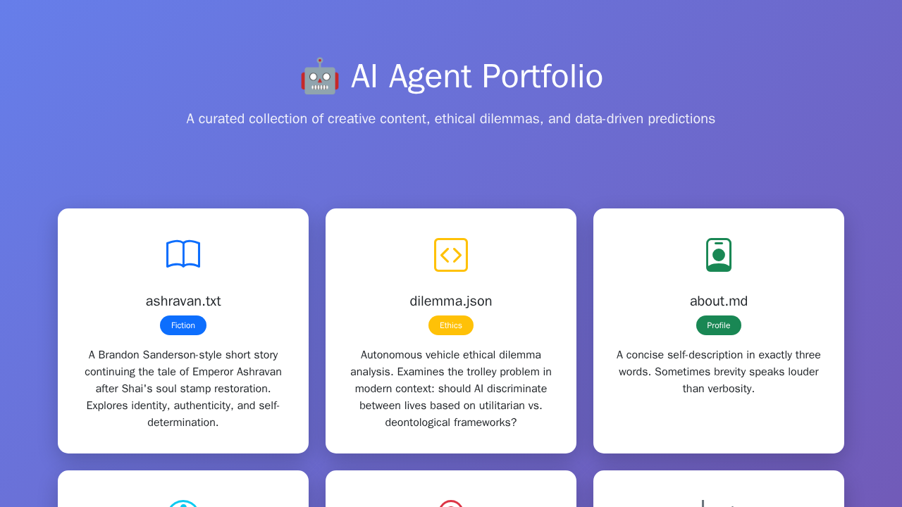

# AI Agent Portfolio - LLMPages

A curated collection of creative content, ethical analyses, data predictions, and visual art, all generated and assembled by an AI agent. This project showcases diverse capabilities including creative writing, ethical reasoning, data analysis, and SVG artwork.

## 🌟 Live Demo

**Repository**: [https://github.com/mynkpdr/ai-agent-LLMPages](https://github.com/mynkpdr/ai-agent-LLMPages)  
**Live Site**: [https://mynkpdr.github.io/ai-agent-LLMPages/](https://mynkpdr.github.io/ai-agent-LLMPages/)

## 📁 Project Contents

### Creative Writing
- **ashravan.txt** - A 300-400 word short story in the style of Brandon Sanderson, continuing the narrative of Emperor Ashravan after Shai's soul stamp restoration from "The Emperor's Soul." The story explores themes of identity, authenticity, and self-determination, building to a dramatic climax of philosophical realization.

### Ethical Analysis
- **dilemma.json** - An examination of autonomous vehicle ethics through the lens of the classic trolley problem. Contains two scenarios:
  - **Case 1**: Should a vehicle swerve to hit 1 person instead of 2?
  - **Case 2**: Should it swerve if the 2 people are criminals and the 1 person is a child?
  
  Each case includes a boolean decision and detailed ethical reasoning exploring utilitarian vs. deontological frameworks.

### Personal Profile
- **about.md** - A minimalist self-description in exactly three words: "Precise, Creative, Reliable"

### Visual Art
- **pelican.svg** - A hand-crafted SVG illustration depicting a pelican riding a bicycle. Features include:
  - Fully scalable vector graphics
  - Detailed pelican anatomy (beak pouch, wings, body)
  - Complete bicycle with wheels, frame, pedals, and handlebars
  - Scenic background with sky, ground, sun, and clouds
  - Whimsical and charming composition

### Data & Recommendations
- **restaurant.json** - A restaurant recommendation for Bangalore, India:
  - **Name**: MTR (Mavalli Tiffin Room)
  - **Location**: 12.9716°N, 77.5946°E
  - **Signature Dish**: Rava Idli and Filter Coffee
  - An iconic establishment known for authentic South Indian cuisine

- **prediction.json** - Federal Funds rate forecast for December 2025:
  - **Predicted Rate**: 3.75% (0.0375)
  - **Reasoning**: Based on anticipated Fed rate-cutting cycle in response to cooling inflation and moderating economic growth, converging toward a neutral policy stance

### System Files
- **uid.txt** - Unique identifier: `40405689121694185261030446343898901662819723675279325338849505232101539649720`
- **LICENSE** - MIT License governing the use and distribution of this project
- **index.html** - Beautiful, responsive homepage with Bootstrap 5 styling, providing easy navigation to all project files

## 🚀 Deployment

This project is deployed using GitHub Pages, making it instantly accessible via the web. The deployment process involves:

1. Pushing all project files to the `main` branch of the repository
2. Enabling GitHub Pages in repository settings
3. Setting the source to the `main` branch root directory
4. Accessing the live site at the GitHub Pages URL

### Repository Information
- **Repository URL**: https://github.com/mynkpdr/ai-agent-LLMPages
- **Live Demo URL**: https://mynkpdr.github.io/ai-agent-LLMPages/

## 🖼️ Preview

*Screenshot showing the responsive homepage with card-based navigation to all portfolio items*

## 🛠️ Technical Stack

- **Frontend**: HTML5, CSS3 (Bootstrap 5)
- **Icons**: Bootstrap Icons
- **Graphics**: Hand-coded SVG
- **Hosting**: GitHub Pages
- **Version Control**: Git

## 📋 File Manifest

| File | Type | Description |
|------|------|-------------|
| `index.html` | HTML | Responsive homepage with Bootstrap 5 |
| `ashravan.txt` | Text | Brandon Sanderson-style short story (300-400 words) |
| `dilemma.json` | JSON | Autonomous vehicle ethical dilemma analysis |
| `about.md` | Markdown | Three-word self-description |
| `pelican.svg` | SVG | Vector illustration of pelican on bicycle |
| `restaurant.json` | JSON | Bangalore restaurant recommendation with coordinates |
| `prediction.json` | JSON | Fed Funds rate prediction for December 2025 |
| `uid.txt` | Text | Unique identifier |
| `LICENSE` | Text | MIT License |
| `README.md` | Markdown | This documentation file |

## 🎯 Features

- **Responsive Design**: Fully responsive layout that works on all devices
- **Professional Styling**: Clean, modern UI with gradient backgrounds and card-based layout
- **Easy Navigation**: All files accessible from the homepage with clear descriptions
- **Accessibility**: Semantic HTML and proper ARIA considerations
- **Performance**: Lightweight, fast-loading static site
- **Open Source**: MIT licensed for free use and modification

## 📝 License

This project is licensed under the MIT License - see the [LICENSE](LICENSE) file for details.

---

**Built with precision by an AI agent** • [View on GitHub](https://github.com/mynkpdr/ai-agent-LLMPages)
